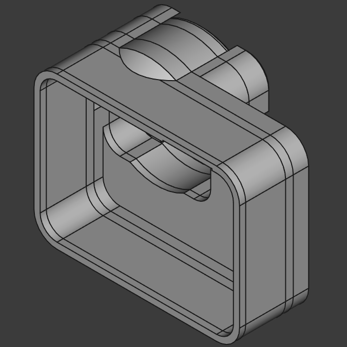
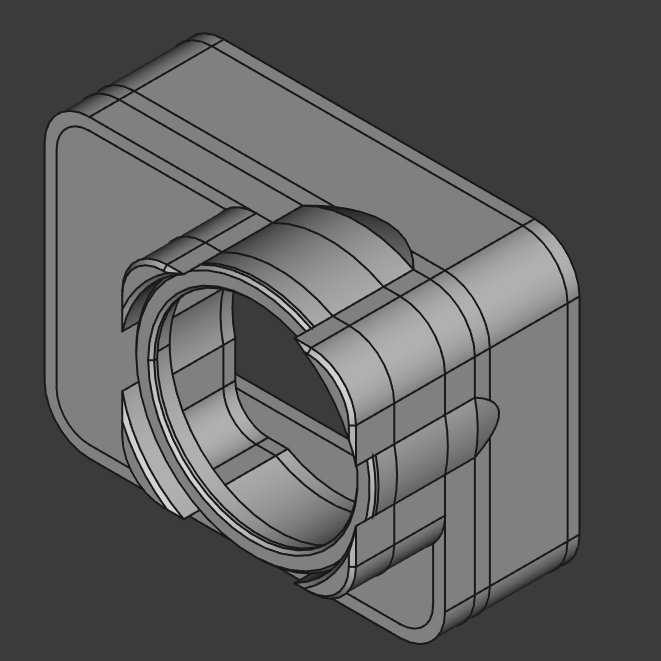
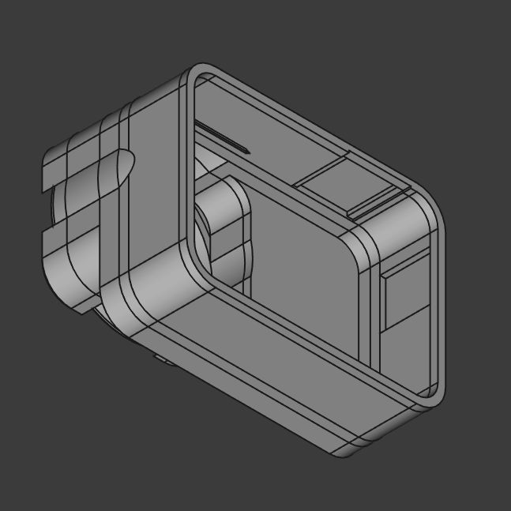

# Project Status
This project is a **work in progress (WIP)**. Feel free to fork it and contribute improvements.

# Project Overview
This project is for a protective case designed specifically for the **[GoXtreme Manta 4K](https://www.goxtreme-action-cams.com/en/goxtreme-manta-4k-2/) action camera**.
# Design Details
The design was created using **FreeCAD** and is intended to be **3D printable**.

## Lens Slot
The slot in front of the lens is designed to hold a **36mm x 3mm** watch crystal. A thinner crystal can also be used if preferred.

Example of a compatible crystal:
[36mm Watch Crystal on Amazon](https://www.amazon.co.uk/Large-Watch-pocketwatch-Crystal-Mineral/dp/B01DI59KEU)

